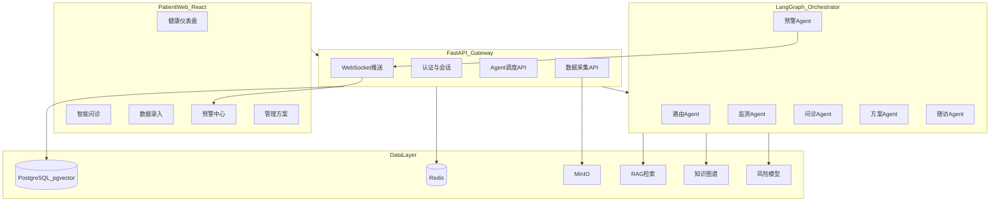
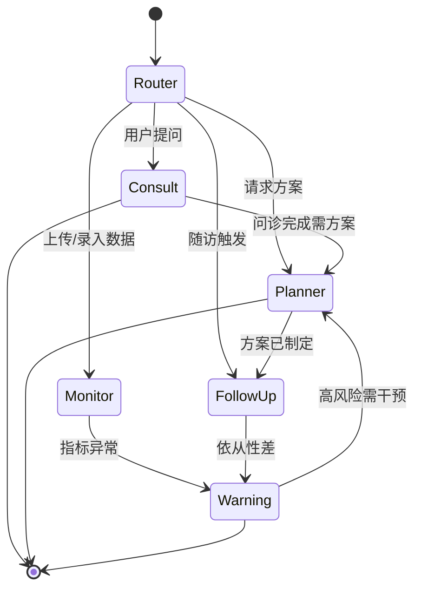

# 贴心小护士 — 多智能体慢病管理平台实施计划

## 项目定位

- **目标**：竞赛/结项答辩可演示完整闭环，同时架构与数据模型按**可上线**标准设计（非一次性 Demo）
- **首期范围**：**患者端 Web**（React），支持多慢病（2 型糖尿病、高血压、高血脂、慢阻肺等）；医护端、HIS 对接作为二期扩展点预留接口
- **技术栈**（用户指定 + AI 层补充）：

| 层级 | 选型 | 说明 |
|------|------|------|
| 前端 | React 18 + TypeScript + Vite + Ant Design Mobile / Tailwind | 适配居家患者，移动端优先 |
| API 网关 | FastAPI (Python 3.11+) | REST + WebSocket（实时预警推送） |
| 多智能体 | **LangGraph** | 状态机式编排，便于答辩展示 Agent 协作链路 |
| 大模型 | 国内 API（DeepSeek / 通义千问，可配置切换） | RAG 增强，竞赛阶段不做全量微调 |
| 主库 | **PostgreSQL 16 + pgvector** | 业务数据 + 向量检索，减少组件数 |
| 缓存/队列 | **Redis 7** | 会话、限流、预警队列、Agent 任务状态 |
| 对象存储 | MinIO（本地）/ 阿里云 OSS（生产） | 体检报告影像、上传文件 |
| 部署 | Docker Compose → 后期 K8s | 一键演示环境 |

> 说明：React + PostgreSQL + Redis 为用户指定；Python FastAPI + LangGraph 是此前确认的多智能体方案，与 React 通过 REST/WebSocket 解耦，是业界标准组合。

---

## 系统架构



---

## 多智能体角色设计（答辩核心亮点）

| Agent | 职责 | 输入 | 输出 |
|-------|------|------|------|
| **Orchestrator（路由）** | 意图识别、任务分发、多 Agent 协调 | 用户消息 + 患者上下文 | 调用子 Agent、汇总回复 |
| **监测 Agent** | 解析生理时序/行为数据，计算趋势 | 血压/血糖/步数等待录入或设备同步 | 结构化指标 + 异常标记 |
| **问诊 Agent** | 口语化问诊、症状收集 | 自然语言 + 病史 RAG | 结构化问诊记录 + 回复 |
| **方案 Agent** | 基于指南推荐饮食/运动/用药建议 | 患者档案 + KG + 指南 RAG | 个性化管理方案（JSON） |
| **随访 Agent** | 定时随访、依从性评估 | 方案执行情况 | 随访问题 + 评分 |
| **预警 Agent** | 风险分级、触发干预 | ML 模型分数 + 规则引擎 | 预警等级 + 建议 + Redis 推送 |

**LangGraph 状态流**（可录屏演示）：



---

## 六大研究方向 → 可落地模块映射

### 1. 多源多模态数据融合

- **统一数据模型**（PostgreSQL）：`patients`、`health_records`（时序）、`lifestyle_logs`、`medical_documents`（文本/OCR）、`imaging_reports`（影像元数据）
- **预处理管道**（FastAPI 后台任务 + Redis 队列）：
  - 文本：PDF/图片 → OCR（PaddleOCR）→ 结构化字段抽取（LLM）
  - 时序：血压/血糖标准化（单位、时间戳对齐）
  - 行为：饮食/运动/作息表单 + 可选可穿戴 API 适配层（接口预留）
- **融合层**：患者「健康画像」聚合表 + 向量 embedding 写入 pgvector，供 RAG 检索

### 2. 慢病领域大模型（竞赛阶段：RAG 为主）

- **不做全量微调**（成本/周期），采用 **RAG + Prompt 工程 + 结构化输出**：
  - 知识来源：中国慢病防治指南、临床路径摘要（PDF 切片入库）
  - 系统 Prompt 注入角色约束、免责声明、引用来源
- **二期预留**：LoRA 微调脚本目录 + 训练数据格式规范（答辩时可作为「后续工作」展示）

### 3. 多智能体协同（LangGraph 核心）

- 共享 **PatientContext**（Redis 缓存 + PG 持久化）：档案、最近指标、活跃方案、未处理预警
- Agent 间通过 Graph State 传递结构化消息，Orchestrator 负责冲突消解（如预警优先于普通问诊）
- **可观测性**：每次 Agent 调用记录 `agent_traces` 表，答辩 UI 展示「Agent 协作链路图」

### 4. 实时监测与动态风险预警

- **规则引擎**（首期）：各慢病阈值配置表（如空腹血糖 > 7.0 → 黄色预警）
- **ML 模型**（首期轻量）：基于 scikit-learn / XGBoost 的时序异常检测（Isolation Forest 或 LSTM 简化版），输入近 7/30 天指标
- **实时引擎**：数据写入 → Redis Stream → 预警 Worker → WebSocket 推送到前端
- 预警等级：绿 / 黄 / 橙 / 红，对应不同干预文案（由预警 Agent + 模板生成）

### 5. 慢病知识图谱

- **首期**：PostgreSQL 关系表模拟 KG（`diseases`、`symptoms`、`treatments`、`drug_interactions`、`diet_recommendations`），支持多慢病扩展
- **查询**：方案 Agent 通过 SQL + 图遍历逻辑（非 Neo4j，降低运维复杂度）；答辩可展示图谱可视化（React + D3/ECharts）
- **动态更新**：管理员脚本导入新指南 JSON → 增量 upsert（二期做 Web 管理后台）

### 6. 患者端平台（React）

核心页面（移动端优先）：

1. **登录/注册 + 慢病档案建档**（多选慢病类型）
2. **健康仪表盘**：今日指标、趋势图、预警徽章
3. **数据录入**：血压/血糖/体重/饮食/运动/作息
4. **智能问诊**（Chat UI）：流式回复 + Agent 链路可视化侧栏
5. **管理方案**：饮食/运动/监测频率建议（可标记完成）
6. **预警中心**：历史预警 + 处理建议
7. **随访任务**：问卷式随访 + 依从性评分
8. **报告上传**：体检报告 OCR 解析结果展示

**生产级必备**（非 Demo 阉割）：
- JWT 认证 + Refresh Token（Redis 黑名单）
- 输入校验、速率限制、审计日志
- 医疗免责声明与用户知情同意
- 敏感数据加密（密码 bcrypt，可选字段 AES）
- 环境变量配置（`.env` / Docker secrets）

---

## 项目目录结构（建议）

```
nurse-assistant/
├── frontend/                 # React + Vite
│   ├── src/pages/            # 各功能页面
│   ├── src/components/       # Chat、Chart、AgentTrace 等
│   └── src/api/              # API 客户端
├── backend/
│   ├── app/
│   │   ├── api/              # FastAPI 路由
│   │   ├── agents/           # LangGraph 各 Agent 定义
│   │   ├── graph/            # Orchestrator 状态图
│   │   ├── models/           # SQLAlchemy 模型
│   │   ├── services/         # 业务逻辑、RAG、预警
│   │   ├── ml/               # 风险模型
│   │   └── tasks/            # 异步任务（Celery/ARQ + Redis）
│   ├── knowledge/            # 指南 PDF、KG 种子数据
│   └── alembic/              # 数据库迁移
├── docker-compose.yml        # PG + Redis + MinIO + backend + frontend
└── docs/                     # 答辩文档、架构图、API 文档
```

---

## 分阶段实施路线

### Phase 1 — 基础骨架（约 1 周）
- 初始化 monorepo、Docker Compose（PostgreSQL + Redis + MinIO）
- FastAPI 项目脚手架：认证、患者 CRUD、Alembic 迁移
- React 脚手架：路由、登录、基础 Layout
- 核心表结构：`users`、`patients`、`health_records`、`alerts`

### Phase 2 — 数据采集与仪表盘（约 1 周）
- 时序数据录入 API + 前端表单/图表（Recharts/ECharts）
- 生活方式日志、报告上传（MinIO + OCR 管道）
- 健康仪表盘与趋势展示

### Phase 3 — 多智能体核心（约 1.5 周，答辩重点）
- LangGraph Orchestrator + 5 个子 Agent
- RAG 管道：指南文档切片 → pgvector → 检索增强
- 智能问诊 Chat UI（SSE 流式）+ Agent 协作链路展示
- 方案 Agent 输出结构化 JSON → 前端方案页

### Phase 4 — 预警与随访闭环（约 1 周）
- 规则引擎 + ML 风险模型
- Redis Stream 预警 Worker + WebSocket 推送
- 随访 Agent + 定时任务（APScheduler / Celery Beat）
- 预警中心、随访任务页

### Phase 5 — 知识图谱与 polish（约 0.5 周）
- KG 种子数据（四慢病核心实体关系）
- 图谱可视化页面
- 演示数据脚本、答辩 PPT 素材（架构图、Demo 流程）
- 安全加固、README、部署文档

---

## 竞赛答辩 Demo 脚本（5 分钟）

1. **建档**：患者选择「2 型糖尿病 + 高血压」，录入近 7 天血糖/血压
2. **异常触发**：录入一条超标血糖 → 监测 Agent 标记 → 预警 Agent 推送橙色预警
3. **智能问诊**：「最近头晕怎么办？」→ 路由 → 问诊 Agent（RAG 引用指南）→ 方案 Agent 调整饮食建议
4. **展示 Agent 链路**：侧栏显示 Orchestrator → Consult → Planner 协作过程
5. **随访闭环**：系统推送随访任务，患者反馈依从性，随访 Agent 评估

---

## 关键设计决策说明

| 决策 | 理由 |
|------|------|
| Python 后端 + React 前端分离 | LangGraph 生态在 Python；React 满足用户指定与移动端体验 |
| pgvector 而非独立向量库 | 减少运维，PostgreSQL 已满足中等规模 RAG |
| 关系表模拟 KG 而非 Neo4j | 竞赛周期内可交付、可查询；二期可迁移 |
| RAG 替代模型微调 | 2–4 周内可出专业输出；微调作为二期研究点 |
| 患者端优先 | 符合用户选择；API 层预留 `role=doctor` 扩展 |

---

## 风险与缓解

- **医疗合规**：所有 AI 输出标注「仅供参考，请遵医嘱」；不做诊断结论，只做健康管理建议
- **LLM 幻觉**：强制 RAG 引用 + 结构化输出校验 + 高风险场景规则兜底
- **OCR 准确率**：人工确认环节 + 可编辑解析结果
- **竞赛时间紧**：Phase 3/4 为 MVP 关键路径，KG 可视化可简化但 Agent 链路必须完整

---

## 首期交付物清单

- 可 Docker 一键启动的完整应用
- 患者端 8 大功能页面
- 6 Agent LangGraph 协作 + 可追溯链路
- 多慢病档案 + 时序监测 + 规则/ML 预警
- RAG 知识问答 + 方案推荐
- 知识图谱数据 + 可视化
- 部署文档 + 答辩 Demo 脚本
